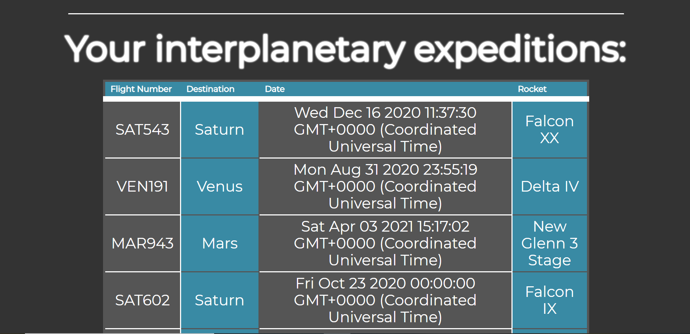

# Interplanetary Travel Planner

---

## Plan a trip and peruse the universe!

A unique perspective on a very old idea - space travel. Interplanetary travel made easy for everyone 
Pick the planet you want to visit and we will do the rest! This includes all the information you could need to plan your otherworldly adventure, to infinity and beyond! 
Time flies differently in the space, so don’t forget to ask someone to check your mailbox now and then.

## What is Interplanetary Travel Planner?

Interplanetary Travel Planner began as an assignment to build a fully functioning web application with an attractive front end and a database connected to the back end using an ORM to provide users with a functional CRUD application. Inspired by their love of modern space exploration technology, the creators decided to build the travel planning platform of the not-so-distant future, a place where users could get informed about planets to visit and actually book a flight to another planet, aboard the most impressive rockets that represent the pinnacle of human achievement! 

## Check it Out!

What are you waiting for? Head over to our <a href="https://interplanetarytravel.space">hosted application</a> and book your first flight now! 

# <a href="https://interplanetarytravel.space"> Interplanetary Travel Planner </a>